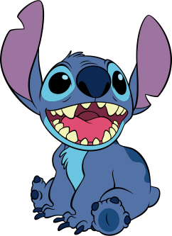

# Tanglesites
> This is my github,  I found it, all on my own. It's little, and broken, but still good... Yeah. Still good. 

## Are ya impressed yet? 

## It doesn't get pissed off. It doesn't get happy, it doesn't get sad, it doesn't laugh at your jokes... It just runs programs.

  

## I see 'Chopsticks.'

## Right. Well, I mean, when it came to stuff like that… I could always just play.

## References: ’This… stuff’? Oh. Okay. I see. You think this has nothing to do with you
**Github-Readme-Stats:** https://github.com/anuraghazra/github-readme-stats 
**Wakatime:** https://wakatime.com

### Footer

<footer style="font-size: 12px;">
  All other trademarks referenced in the this README.md are the property of their respective owners. Reference on the Services to any products, services, processes or other information, by trade name, trademark, manufacturer, supplier, or otherwise does not constitute or imply endorsement, sponsorship, or recommendation thereof by us or any other affiliation.
</footer>

### I’d prefer you just said thank you and went on your way.
